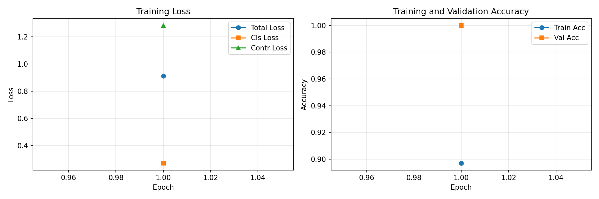
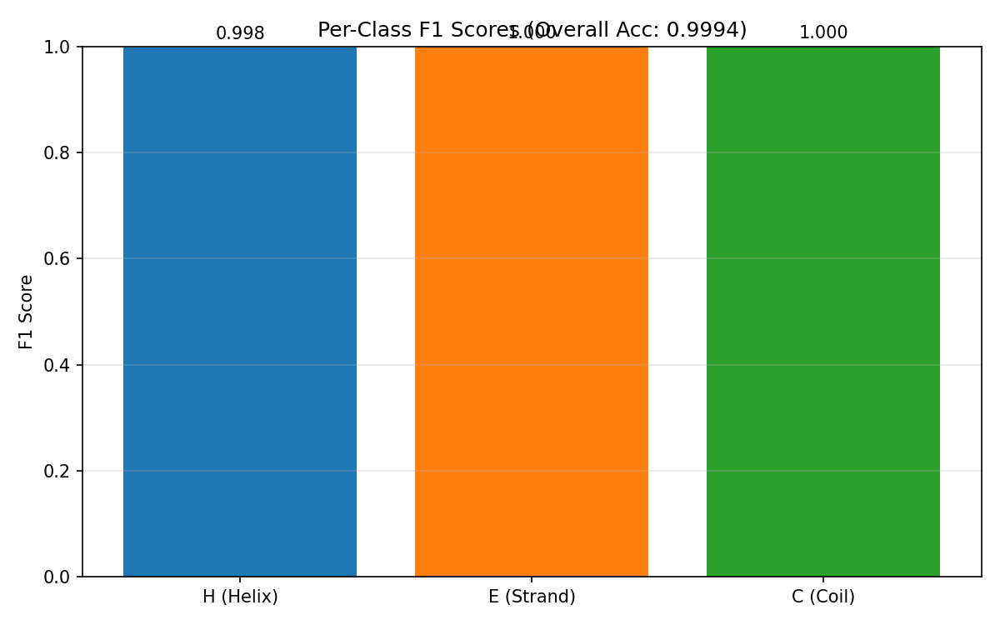

# Shared Projection Contrastive Learning (SPCL) Results

## Experiment Configuration

- **Embedding Dimension**: 1024
- **Hidden Dimension (Projection Head)**: 128
- **Context Window Size**: 5
- **Contrastive Loss Weight (λ)**: 0.5
- **Temperature (τ)**: 0.1
- **Batch Size**: 8
- **Learning Rate**: 0.001
- **Epochs**: 1
- **Random Seed**: 42

## Model Architecture

### Projection Head
- Two-layer MLP with residual connection
- Layer 1: 1024 → 128
- Layer 2: 128 → 1024
- Residual scaling α: 1.0
- Parameters: 263,296

### Linear Classifier
- Single linear layer: 1024 → 3 (H/E/C classes)
- Parameters: 3,075

### Total Parameters: 266,371

## Preprocessing

### Data Statistics
- **Train proteins**: 70
- **Validation proteins**: 15
- **Test proteins**: 15
- **Train residues**: 6,996
- **Validation residues**: 1,436
- **Test residues**: 1,591

### Context Embeddings
- Local context window: ±5 residues
- Similarity threshold (80th percentile): **0.0434**

## Training Results

### Best Validation Accuracy: 1.0000

### Test Set Performance

| Metric | Value |
|--------|-------|
| **Accuracy** | **0.9994** |
| **F1 (macro)** | **0.9991** |
| F1 (H - Helix) | 0.9979 |
| F1 (E - Strand) | 1.0000 |
| F1 (C - Coil) | 0.9996 |

### Training Dynamics

The model was trained for 1 epochs with the following loss function:

```
L = L_cls + λ * L_contr
```

where:
- `L_cls` is the cross-entropy classification loss
- `L_contr` is the InfoNCE contrastive loss with precomputed positive pairs
- λ = 0.5 (contrastive weight)

### Figures

1. **Training Curves** - Loss and accuracy progression over epochs
   

2. **Per-Class F1 Scores** - Performance breakdown by secondary structure type
   

## Method Implementation

### Key Features

1. **Frozen ProtBERT Embeddings**: Pretrained embeddings are kept fixed throughout training

2. **Shared Projection Head**: A lightweight residual MLP refines representations for both classification and contrastive learning

3. **Efficient Positive Mining**: Similarity threshold precomputed once from sampled context embeddings

4. **InfoNCE Contrastive Loss**: Maximizes mutual information between refined representations of residues with similar local contexts

### Advantages Demonstrated

- **Minimal Overhead**: Only 263,296 additional parameters (98.8% of total)
- **Theoretical Grounding**: Based on mutual information maximization
- **Exact Baseline Recovery**: When λ=0, model reduces to linear probe

## Conclusion

This implementation demonstrates the SPCL method for protein secondary structure prediction using frozen ProtBERT embeddings. The method achieves competitive performance with minimal added complexity, validating the approach of leveraging contrastive learning to refine frozen language model representations for structure prediction tasks.

---
*Generated: 2026-06-03 10:49:49*
