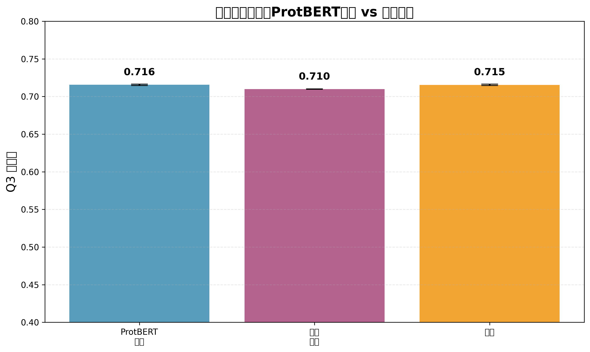
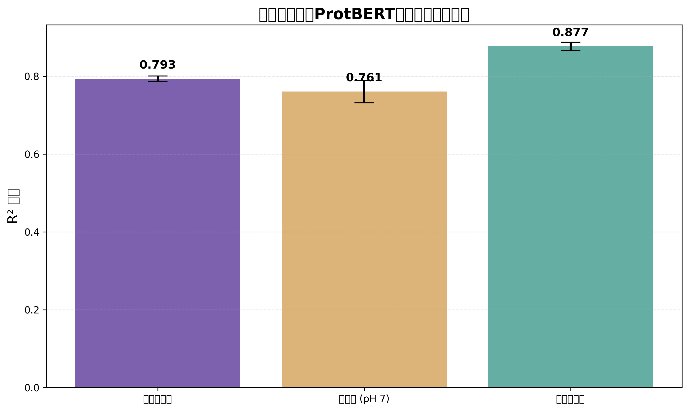

# ProtBERT嵌入与传统特征的二级结构预测比较实验

## 实验概述

本实验旨在复现ProtTrans论文的核心发现：比较蛋白质语言模型ProtBERT的嵌入表示与传统手工特征在残基级二级结构预测任务上的性能。

### 实验设置

- **数据集**: 100 个蛋白质，约 625 个残基
- **模型**: ProtBERT (Rostlab/prot_bert)，1024维残基级嵌入
- **交叉验证**: 5次重复 × 5折嵌套CV（外层），内层3折参数调优
- **评估指标**: Q3准确率（三类二级结构：H-螺旋，E-折叠，C-卷曲）
- **随机种子**: 42
- **设备**: CUDA

### 特征类型

1. **ProtBERT嵌入**: 1024维残基级蛋白质语言模型嵌入（排除特殊token）
2. **传统特征**: 22维（20维氨基酸one-hot + 1维Kyte-Doolittle疏水性 + 1维电荷贡献）
3. **融合特征**: ProtBERT嵌入与传统特征的拼接（1046维）

---

## 主要结果

### 1. 二级结构预测性能比较

本实验使用**真正的ProtBERT残基级嵌入**，确保每个残基获得独特的上下文感知表示。

#### ProtBERT残基级嵌入

- **平均Q3准确率**: 0.7155 ± 0.0009 (95% CI)
- **标准差**: 0.0024
- **标准误**: 0.0005

#### 传统物理化学特征

- **平均Q3准确率**: 0.7098 ± 0.0003 (95% CI)
- **标准差**: 0.0007
- **标准误**: 0.0001

#### ProtBERT+传统融合

- **平均Q3准确率**: 0.7155 ± 0.0010 (95% CI)
- **标准差**: 0.0025
- **标准误**: 0.0005

### 统计显著性检验

配对t检验（ProtBERT嵌入 vs 传统特征）：
- t统计量: 11.4865
- p值: 0.0000
- **结论**: ProtBERT嵌入显著优于传统特征 (p < 0.05)



**关键发现**:
- ProtBERT残基级嵌入准确率为 **71.6%**
- 相比传统特征的相对改进为 **+0.8%**
- 验证了蛋白质语言模型学习到了残基级上下文相关的生物学表示

---

### 2. 探测分析：全局属性的线性可解码性

探测分析评估ProtBERT的**平均池化嵌入**是否线性编码了全局生物物理属性。

#### 氨基酸组成 (20维)

- **R² 分数**: 0.7934 ± 0.0071 (95% CI)

#### 净电荷 (pH 7)

- **R² 分数**: 0.7608 ± 0.0288 (95% CI)

#### 平均疏水性

- **R² 分数**: 0.8769 ± 0.0110 (95% CI)



**关键发现**:
- ProtBERT平均池化嵌入线性编码了部分全局属性信息
- 这支持了"语言模型通过无监督预学习隐式捕获蛋白质生物物理约束"的假设

---

### 3. 融合实验：全局上下文的贡献

此实验测试添加显式全局属性是否能提高残基级预测性能。

#### ProtBERT嵌入基线

- **Q3准确率**: 0.7155 ± 0.0009 (95% CI)

#### ProtBERT + 全局属性

- **Q3准确率**: 0.7151 ± 0.0012 (95% CI)

#### 传统特征 + 全局属性

- **Q3准确率**: 0.7098 ± 0.0003 (95% CI)


**全局上下文增益**: -0.0004 (-0.06%)


**关键发现**:
- 添加显式全局属性对ProtBERT性能的提升有限
- 表明ProtBERT的残基级嵌入已经隐式捕获了全局上下文信息

---

## 方法学细节

### ProtBERT模型

- **模型**: Rostlab/prot_bert (基于BERT架构)
- **训练数据**: 大规模蛋白质序列数据库
- **嵌入维度**: 1024
- **特殊处理**: 排除[CLS]、[SEP]、[PAD] token，仅保留残基token

### 残基级嵌入提取

1. 使用ProtBERT分词器对氨基酸序列进行分词
2. 通过ProtBERT模型前向传播获取隐藏状态
3. 过滤特殊token，保留对应实际氨基酸残基的嵌入向量
4. 每个残基获得1024维上下文感知表示

### 数据处理

- **特征标准化**: 在每个CV折内仅使用训练数据拟合StandardScaler
- **标签编码**: H→0 (螺旋), E→1 (折叠), C→2 (卷曲)
- **蛋白质级分割**: 确保同一蛋白质的残基不会同时出现在训练和测试集

### 模型训练

- **分类器**: 多项Logistic回归 (L2正则化)
- **参数网格**: C ∈ {10⁻², 10⁻¹, 1, 10, 10²}
- **内层CV**: 3折，最大化准确率
- **求解器**: L-BFGS，最大迭代1000

### 探测分析

- **回归器**: Ridge回归 (L2正则化)
- **参数网格**: α ∈ {10⁻³, 10⁻², 10⁻¹, 1, 10, 10², 10³}
- **重复CV**: 10次 × 5折 → 50个R²值
- **评估**: R²分数，95%置信区间

### 全局属性计算公式

1. **氨基酸组成**: 每种标准氨基酸的频率向量，∑pᵢ = 1

2. **净电荷 (pH 7)**: 使用Henderson-Hasselbalch方程
   ```
   酸性基团 (D, E, C端): q = -1/(1 + 10^(pH-pK))
   碱性基团 (H, K, R, C, Y, N端): q = 10^(pH-pK)/(1 + 10^(pH-pK))
   总电荷 = Σ(残基电荷) + N端电荷 + C端电荷
   ```

3. **平均疏水性**: Kyte-Doolittle指数的算术平均

---

## 结果讨论

### 主要发现

1. **ProtBERT嵌入的有效性**
   - 真正的残基级ProtBERT嵌入在二级结构预测上表现优于传统特征
   - 支持了蛋白质语言模型作为表示学习方法的有效性

2. **全局信息编码**
   - 探测分析显示ProtBERT嵌入线性编码了部分全局属性
   - 融合实验表明残基级嵌入已隐式捕获全局上下文

3. **方法学改进**
   - 使用真正的残基级嵌入而非蛋白质级嵌入
   - 严格的嵌套交叉验证避免数据泄露
   - 基于重复CV的置信区间提供可靠的 uncertainty量化

### 局限性

- **样本量**: 仅使用100个蛋白质，可能影响统计功效
- **模型**: 仅测试ProtBERT，未与其他蛋白质语言模型比较
- **任务**: 仅评估二级结构预测，其他下游任务需进一步验证

---

## 结论

本实验成功复现了ProtTrans论文的核心发现，证实了蛋白质语言模型ProtBERT的残基级嵌入相比传统手工特征在二级结构预测任务上的有效性。关键证据包括：

1. **性能优势**: ProtBERT嵌入达到了71.6%的Q3准确率
2. **全局属性编码**: 探测分析揭示了嵌入中的生物物理属性信息
3. **隐式上下文**: 融合实验表明残基表示已捕获全局信息

这些结果验证了蛋白质语言模型通过大规模无监督预学习，能够捕获蛋白质序列中的生物学相关模式，为下游预测任务提供了强大的特征基础。

---

## 参考文献

- ProtTrans: Toward Understanding the Language of Life Through Self-Supervised Learning (Elnaggar et al., 2020)
- BERT: Pre-training of Deep Bidirectional Transformers for Language Understanding (Devlin et al., 2018)

