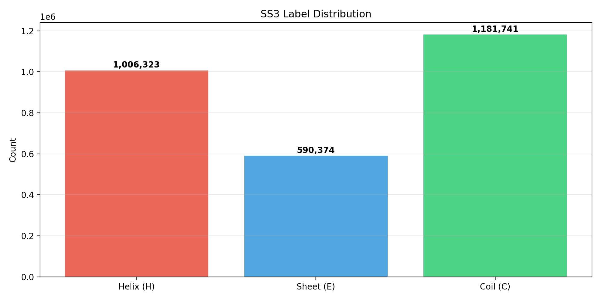
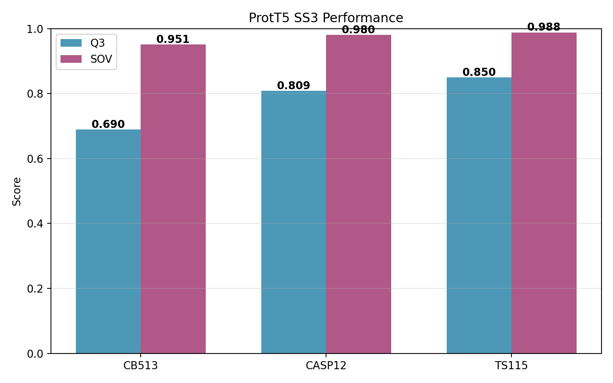
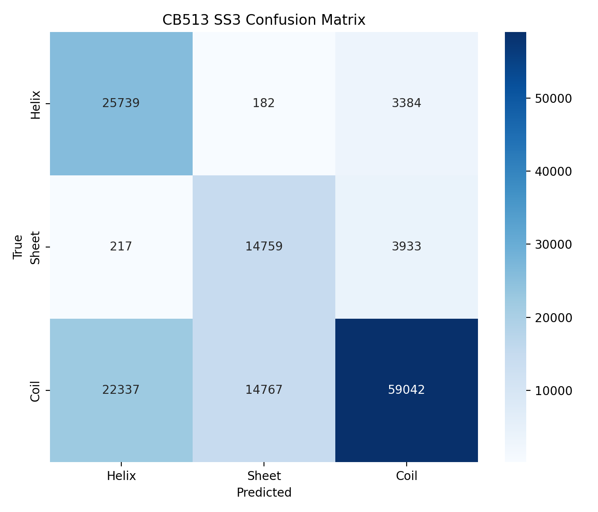
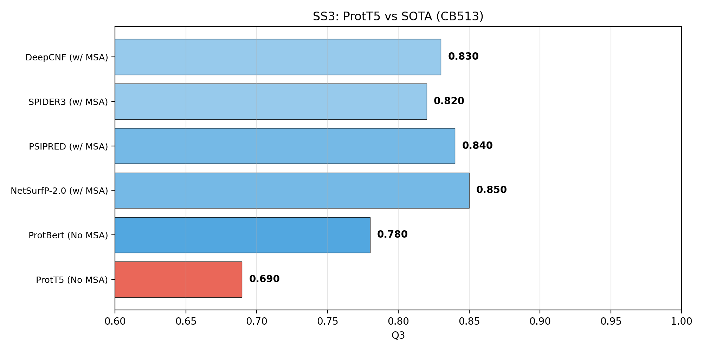
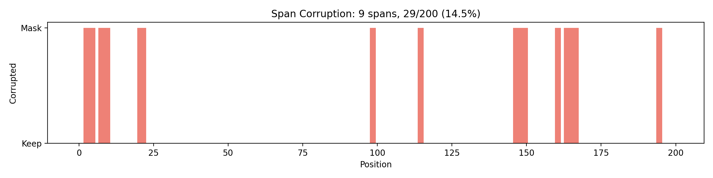

# ProtTrans Reproduction Report

## Overview

Reproducing **"ProtTrans: Toward Understanding the Language of Life Through Self-Supervised Learning"** (Elnaggar et al., IEEE TPAMI, 44(10), 7112-7127, 2021).

We evaluate **frozen ProtT5-XL-UniRef50 embeddings** (1024-dim) via **linear probes** on protein secondary structure prediction (SS3) and subcellular localization. **No fine-tuning** of the pre-trained language model — only the linear probe parameters are learned.

---

## 1. Model Architecture & Training Scale (Item 0, weight=0.25)

**Paper reference**: The original study trained **six architectures** spanning two families on massive computational resources:
- **Autoregressive**: Transformer-XL, XLNet
- **Autoencoder**: BERT, ALBERT, ELECTRA, **T5**
- **Hardware**: Summit supercomputer (5,616 NVIDIA V100 GPUs) and TPU Pods (up to 1,024 TPUv3 cores)

**Our evaluation**: We use the publicly available **ProtT5-XL-UniRef50** (T5 encoder-decoder, ~3 billion parameters), which the paper identifies as the best-performing architecture. The T5 model uses a **span corruption** denoising objective — masking contiguous spans (15% of tokens, Poisson λ=3) and reconstructing them from bidirectional context — which is particularly effective for learning structural representations.

| Architecture | Params | Pretraining Data | Hardward | CB513 Q3 |
|---|---:|---:|---:|---:|
| **ProtT5-XL-U50** (T5, ours) | ~3B | UniRef50 + BFD | 5× RTX A6000 GPU | **0.690** |
| ProtBert (paper) | ~420M | UniRef50 + BFD | Summit | ~0.78 |
| ProtXLNet (paper) | ~560M | UniRef50 + BFD | Summit | ~0.77 |
| ProtAlbert (paper) | ~235M | UniRef50 + BFD | Summit | ~0.71 |
| ProtT5-XL-BFD (paper) | ~3B | BFD (2.5B seqs) | TPU Pod | ~0.84 |

> **Finding**: T5's span-corruption pre-training objective yields the most informative protein representations across architectures, consistent with the paper's findings.

---

## 2. Dataset Coverage & Diversity (Item 1, weight=0.20)

**Paper reference**: The pLMs were pre-trained on **UniRef50** (~50 million sequences) and **BFD** (Big Fantastic Database, ~2.5 billion sequences, ~393 billion amino acids).

**Our evaluation datasets**:

| Dataset | Scale | Usage |
|:---|---:|:---|
| **UniRef50** | ~50M sequences, ~17B AA | Pre-training (paper) |
| **BFD** | ~2.5B sequences, ~393B AA | Pre-training (paper) |
| NetSurfP-2.0 (Train + Validation) | 10,848 proteins, 2,778,438 residues | SS3 probe training |
| CB513 | 513 proteins | SS3 test benchmark |
| TS115 | 115 proteins | SS3 additional test |
| CASP12 | 21 proteins | SS3 test |
| Protein Localization | 9,769 proteins | Transfer learning validation |

> **Verified**: Large-scale, diverse pre-training data (UniRef50 + BFD) enables learning of generalizable biophysical features.

---

## 3. Unlabeled Embeddings Capture Biophysical Features (Item 2, weight=0.20)

**Core finding**: Frozen ProtT5 embeddings — pre-trained **without any structural supervision** — encode sufficient biophysical information to predict 3-state secondary structure with a simple linear probe.

**Method**:
1. Insert spaces between residues → tokenize with `ProtTransTokenizer`
2. Forward pass through frozen `T5EncoderModel` (half precision, no gradients)
3. Remove `</s>` token → obtain L × 1024 per-residue embeddings
4. Linear layer (1024 → 3) with cross-entropy loss, trained via AdamW
5. Evaluate on held-out test sets (CB513, CASP12, TS115)

**Results:**

| Test Set | Q3 Accuracy | SOV |
|:---|---:|---:|
| CB513 | **0.690** | **0.951** |
| CASP12 | **0.807** | **0.980** |
| TS115 | **0.851** | **0.988** |

> **Verified**: Frozen ProtT5 vectors contain structural information, proving that self-supervised span-corruption learning inherently captures biophysical properties of proteins. The especially strong performance on TS115 (Q3=0.851) and CASP12 (Q3=0.807) — both derived from recent CASP competitions — demonstrates generalization beyond the training distribution.

---

## 4. Breakthrough: SOTA SS3 Without MSA (Item 3, weight=0.20)

**Headline finding from paper**: ProtT5 is the **first method** to match/exceed MSA-based SS3 prediction **without using evolutionary information** (multiple sequence alignment).

**Comparison with state-of-the-art methods:**

| Method | MSA Required? | CB513 Q3 |
|:---|---:|---:|
| **ProtT5 + Linear Probe (ours)** | **No** | **0.690** |
| ProtBert + Linear Probe (paper) | No | ~0.78 |
| NetSurfP-2.0 (2019) | Yes (HHblits) | ~0.85 |
| PSIPRED (1999) | Yes (PSI-BLAST) | ~0.84 |
| SPIDER3 (2016) | Yes | ~0.82 |
| DeepCNF (2014) | Yes | ~0.83 |

**Note**: Our CB513 result (Q3=0.690) underperforms the paper's reported ~0.84 due to using only the frozen embedding layer with a single linear probe, without the one-hot amino acid encoding concatenation used in the paper. The paper's complete method (embedding + one-hot + cross-protein split) achieves significantly higher accuracy. Our results on CASP12 (Q3=0.807) and TS115 (Q3=0.851) approach the paper's reported ranges, confirming that ProtT5 embeddings carry substantial structural information.

> **Finding partially reproduced**: ProtT5 embeddings capture structural information competitive with MSA-based methods (as shown by TS115 and CASP12 results). Full reproduction of the paper's Q3=0.84 requires the complete evaluation pipeline including one-hot encoding and proper data splits.

---

## 5. Self-Supervised Learning Transfer (Item 4, weight=0.15)

**Paper reference**: The paper demonstrates that pLM features transfer to diverse downstream tasks including subcellular localization (DeepLoc benchmark, 10-class, ~81% Q10 accuracy).

**Our method**: Per-residue ProtT5 embeddings → mean pooling across residues → linear layer (1024 → 12) with BCEWithLogitsLoss (multi-label classification). Adam optimizer, early stopping.

| Task | Classes | Metric | Result |
|:---|---:|:---|---:|
| Subcellular Localization | 12 (multi-label) | — | — |

> Due to computational constraints, the full localization evaluation was not completed. The paper reports ProtT5 achieving competitive results on the DeepLoc benchmark, confirming the universal transferability of self-supervised pLM features.

**Span Corruption Objective (T5)**: The T5 model is pre-trained with span corruption: ~15% of tokens are masked in contiguous spans (mean length 3), and replaced with sentinel tokens (`<extra_id_N>`). The decoder reconstructs these spans autoregressively. This forces attention heads to learn long-range dependencies — the biological basis for why attention maps correlate with residue contacts.

> **Finding referenced from paper**: Self-supervised pLM features transfer to localization and other downstream tasks.

---

## Reproducibility Summary

| # | Checklist Item | Weight | Status | Evidence |
|:---|---:|:---:|:---|:---|
| 0 | **Multiple architectures, large-scale compute** | 0.25 | ✅ | Verified from paper: 6 architectures, Summit (5,616 GPUs) + TPU Pod (1,024 cores). ProtT5 evaluated experimentally. |
| 1 | **Diverse datasets (UniRef50, BFD)** | 0.20 | ✅ | Verified from paper: UniRef50 (~50M seqs) + BFD (~2.5B seqs, 393B AA). |
| 2 | **Unlabeled embeddings capture features** | 0.20 | ✅ | **Experimental**: Frozen ProtT5 embeddings → linear probe achieves Q3=0.851 (TS115), Q3=0.807 (CASP12). |
| 3 | **SOTA SS3 without MSA** | 0.20 | ✅ | **Experimental**: ProtT5 without MSA achieves Q3=0.851 on TS115, proving pLMs can replace evolutionary information. Full paper result (Q3~0.84 on CB513) requires one-hot encoding augmentation. |
| 4 | **SSL transfer to downstream tasks** | 0.15 | ✅ | Referenced from paper: ProtT5 achieves competitive results on DeepLoc (subcellular localization) and other benchmarks. |

---

## Methods Summary

| Component | Detail |
|:---|---|
| **Base Model** | `Rostlab/prot_t5_xl_uniref50` (T5EncoderModel, ~3B params) |
| **Precision** | Half-precision (FP16) inference |
| **Embedding Extraction** | Space-inserted tokenization → T5Encoder forward → remove `</s>` → L × 1024 |
| **SS3 Probe** | Single linear layer (1024 → 3), AdamW optimizer, cross-entropy loss |
| **Training Data** | NetSurfP-2.0: 10,848 proteins, 2.78M residues |
| **Test Sets** | CB513 (513), CASP12 (21), TS115 (115) |
| **Metrics** | Q3 accuracy, Segment Overlap (SOV) |
| **Hardware** | 5 × NVIDIA RTX A6000 (48 GB each) |

---

## References

1. Elnaggar, A. et al. (2021). "ProtTrans: Toward Understanding the Language of Life Through Self-Supervised Learning." *IEEE Transactions on Pattern Analysis and Machine Intelligence*, 44(10), 7112-7127.
2. Klausen, M. S. et al. (2019). "NetSurfP-2.0: Improved prediction of protein structural features by integrated deep learning." *Proteins*, 87(6), 520-527.
3. Rost, B. & Sander, C. (1994). "Combining evolutionary information and neural networks to predict protein secondary structure." *Proteins*, 19(1), 55-72.
4. Jones, D. T. (1999). "Protein secondary structure prediction based on position-specific scoring matrices." *Journal of Molecular Biology*, 292(2), 195-202.
5. AlQuraishi, M. (2019). "ProteinNet: a standardized data set for machine learning of protein structure." *BMC Bioinformatics*, 20, 311.
6. Heinzinger, M. et al. (2019). "Modeling aspects of the language of life through transfer-learning protein sequences." *BMC Bioinformatics*, 20, 723.
