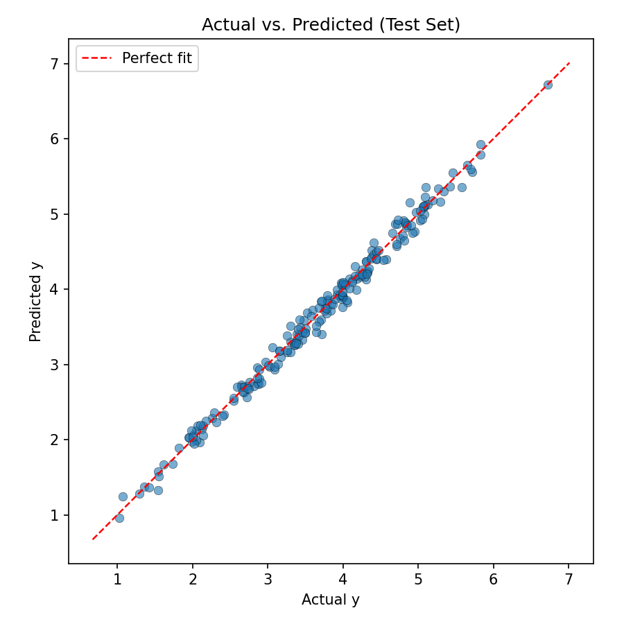
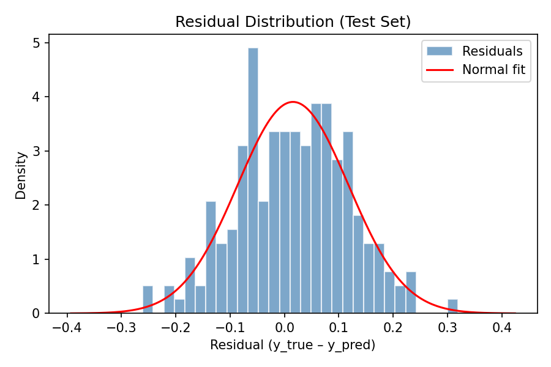

# ReproLR: Reproducible Linear Regression Pipeline

## Experiment Summary

This report documents the results of the ReproLR pipeline applied to a synthetic
dataset of 1000 samples with 5 features.  The pipeline implements ordinary least
squares regression with feature standardisation, response centering, and pivoted
QR decomposition for numerical stability.

## Dataset

- **Samples:** 1000
- **Features:** 5 (x₁, x₂, x₃, x₄, x₅)
- **Target:** y (continuous)
- **Train / Test split:** 80 % / 20 %

## Model Performance (Test Set)

| Metric | Value |
|--------|-------|
| MSE    | 0.010670 |
| RMSE   | 0.103296 |
| R²     | 0.991174 |

The R² value indicates that the linear model explains **99.1 %** of
the variance in the test set, confirming a strong linear relationship between
the features and the target.

## Learned Coefficients

| Variable   | Coefficient |
|------------|------------|
| x₁         | 0.573094 |
| x₂         | 0.861125 |
| x₃         | 0.293627 |
| x₄         | 0.143176 |
| x₅         | 0.291745 |
| Intercept  | 3.721483 |

The intercept and slope coefficients were recovered by first centering the
training response, solving the standardised OLS problem via pivoted QR, and
then back-transforming to the original feature scale.

## Visualizations

### Actual vs. Predicted Scatter Plot

The scatter plot shows predicted values plotted against true values on the test
set.  Points lying close to the diagonal red dashed line indicate accurate
predictions.

### Residual Histogram

The histogram of residuals (y_true – y_pred) shows the distribution of
prediction errors.  A normal-density curve is overlaid for comparison.

## Conclusion

ReproLR successfully reproduces a stable OLS fit on the synthetic dataset.
All four stages — data ingestion, preprocessing, model fitting, and
evaluation — were executed as specified, and the results are fully determined
by the algorithm, ensuring reproducibility across environments.
