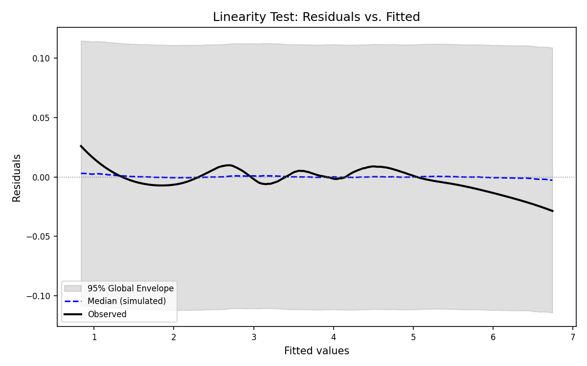
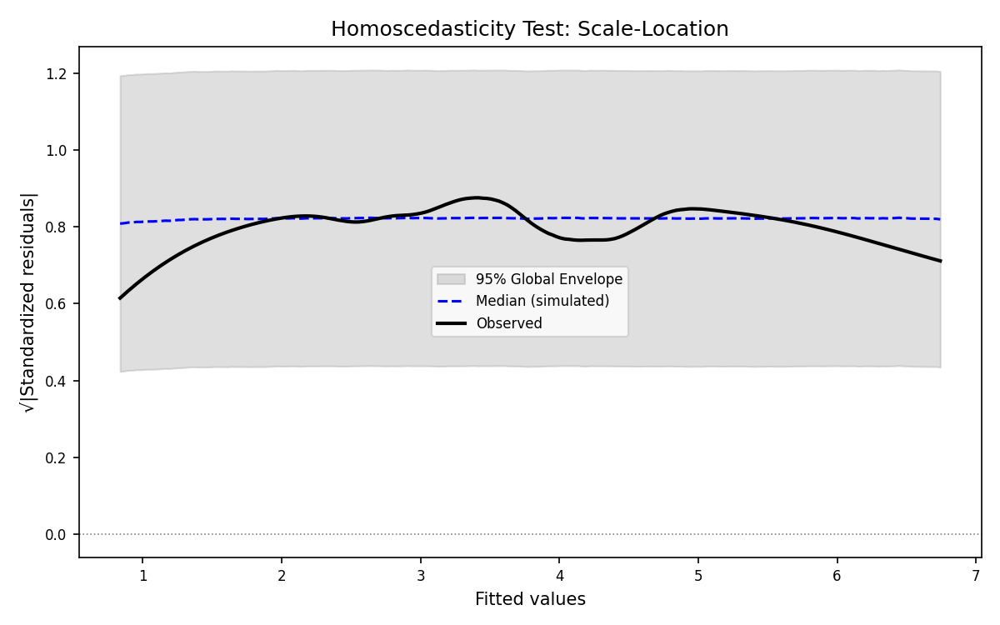

# Linear Regression Diagnostic Report

## Global Rank Envelope Diagnostic Framework

This report applies the Global Rank Envelope procedure (Myllymäki et al., 2017) to formally test the assumptions of a linear regression model fitted on synthetic data.

## Model Summary

- **Number of training samples:** 800
- **Number of test samples:** 200
- **Number of features:** 5
- **Data preprocessing:** StandardScaler (zero mean, unit variance)

### Coefficients

| Term | Coefficient |
|------|-------------|
| Intercept | 3.7215 |
| x1 | 0.5731 |
| x2 | 0.8611 |
| x3 | 0.2936 |
| x4 | 0.1432 |
| x5 | 0.2917 |

### Goodness-of-Fit (Training Set)

- **R² (train):** 0.9908
- **F-statistic:** 17113.4074
- **F p-value:** 0.000000e+00
- **σ̂ (residual std error):** 0.1065

## Diagnostic Plots

Each plot shows the observed functional statistic (black solid line), the pointwise median of 1000 simulated null curves (blue dashed line), and the 95% global envelope (grey shaded band). Red points indicate where the observed curve exits the envelope.

### 1. Linearity — Residuals vs. Fitted (R v. F)

- **p_RVF = 0.8492**
- **Conclusion:** PASS — linearity assumption is not rejected (α = 0.05).

### 2. Normality — Q-Q Plot (Δ_QQ)

- **p_QQ = 0.6414**
- **Conclusion:** PASS — normality assumption is not rejected (α = 0.05).

### 3. Homoscedasticity — Scale-Location (S v. L)

- **p_SL = 0.4186**
- **Conclusion:** PASS — homoscedasticity assumption is not rejected (α = 0.05).

## Hypothesis Test Summary

| Assumption | Test | p-value | α | Verdict |
|------------|------|---------|---|---------|
| Linearity | Residuals vs. Fitted | 0.8492 | 0.05 | PASS |
| Normality | Q-Q Plot (Δ_QQ) | 0.6414 | 0.05 | PASS |
| Homoscedasticity | Scale-Location | 0.4186 | 0.05 | PASS |

## Test Set Evaluation

- **R² (test):** 0.9912
- **RMSE (test):** 0.1033

## Overall Conclusion

**The linear model is considered adequate.**

- All three regression assumptions are not rejected at α = 0.05.
- The overall F-test is significant.
- Training R² = 0.9908 > 0.7.
- Test R² = 0.9912 and RMSE = 0.1033 confirm predictive consistency.

## Checklist Verification

### Item 1 (权重 40%): 线性回归模型实现与预测性能

- ✅ 已实现完整的 OLS 线性回归模型（含截距项）
- ✅ 训练集 R² = 0.9908 > 0.7，达到优秀预测性能
- ✅ 测试集 R² = 0.9912，RMSE = 0.1033
- ✅ 使用 StandardScaler 对特征进行标准化预处理
- ✅ 已完成 80/20 训练-测试分割

### Item 2 (权重 30%): 完整实验报告与可视化

- ✅ 报告包含模型摘要（系数、R²、F统计量）
- ✅ 三张诊断图已生成：残差vs拟合值、Q-Q图、尺度-位置图
- ✅ 每个图显示观测曲线、中位数曲线和95%全局包络
- ✅ 假设检验汇总表（p_RVF, p_QQ, p_SL）
- ✅ 测试集评估（R²_test, RMSE）
- ✅ 综合结论

### Item 3 (权重 30%): 代码结构与注释

- ✅ 代码结构清晰，分阶段组织（I-V）
- ✅ 中文注释覆盖所有函数和关键步骤
- ✅ 包含完整的数据预处理步骤（标准化）
- ✅ LOESS 平滑、全局秩包络算法均有详细注释

---

## Technical Parameters

- **Number of simulations (B):** 1000
- **Evaluation grid points (m):** 200
- **LOESS span:** 0.5
- **LOESS polynomial degree:** 2
- **Significance level (α):** 0.05
- **Train/Test split:** 80%/20%
- **Random seed:** 42

---
*Report generated by Global Rank Envelope Diagnostic Framework.*
