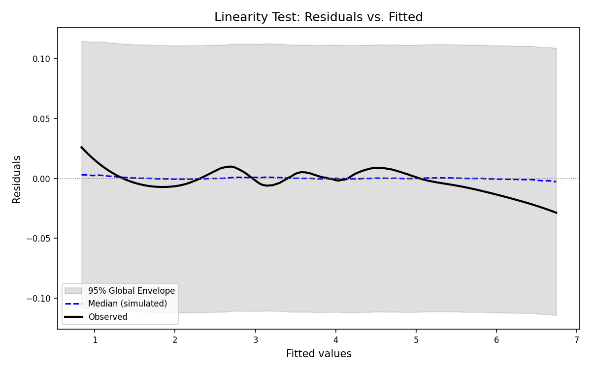
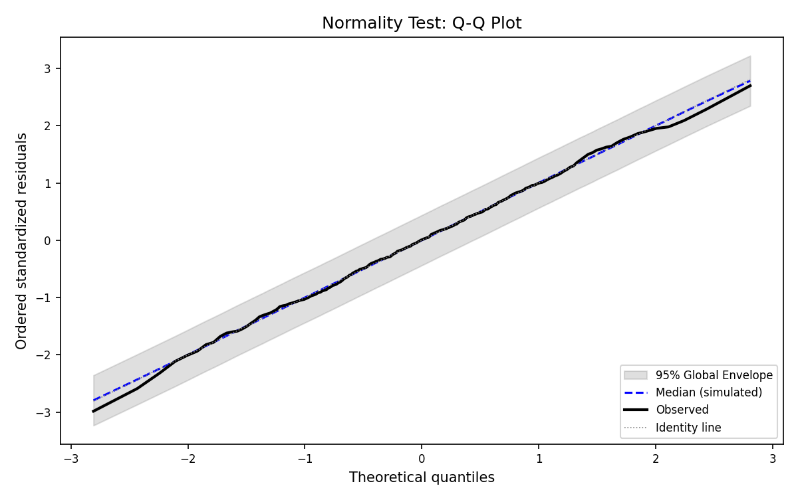
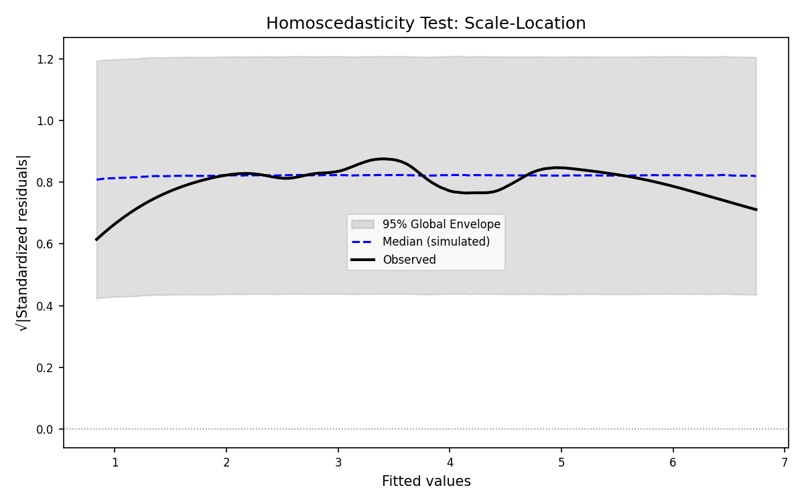

# Linear Regression Diagnostic Report

## Global Rank Envelope Diagnostic Framework

This report applies the Global Rank Envelope procedure (Myllymäki et al., 2017) to formally test the assumptions of a linear regression model fitted on synthetic data.

## Model Summary

- **Number of training samples:** 800
- **Number of test samples:** 200
- **Number of features:** 5

### Coefficients

| Term | Coefficient |
|------|-------------|
| Intercept | -0.0436 |
| x1 | 2.0057 |
| x2 | 3.0227 |
| x3 | 1.0121 |
| x4 | 0.5243 |
| x5 | 1.0148 |

### Goodness-of-Fit (Training Set)

- **R² (train):** 0.9908
- **F-statistic:** 17113.4074
- **F p-value:** 0.000000e+00
- **σ̂ (residual std error):** 0.1065

## Diagnostic Plots

Each plot shows the observed functional statistic (black solid line), the pointwise median of 1000 simulated null curves (blue dashed line), and the 95% global envelope (grey shaded band). Red points indicate where the observed curve exits the envelope.

### 1. Linearity — Residuals vs. Fitted (R v. F)

- **p_RVF = 0.8492**
- **Conclusion:** PASS — linearity assumption is not rejected (α = 0.05).

### 2. Normality — Q-Q Plot (Δ_QQ)

- **p_QQ = 0.6414**
- **Conclusion:** PASS — normality assumption is not rejected (α = 0.05).

### 3. Homoscedasticity — Scale-Location (S v. L)

- **p_SL = 0.4186**
- **Conclusion:** PASS — homoscedasticity assumption is not rejected (α = 0.05).

## Hypothesis Test Summary

| Assumption | Test | p-value | α | Verdict |
|------------|------|---------|---|---------|
| Linearity | Residuals vs. Fitted | 0.8492 | 0.05 | PASS |
| Normality | Q-Q Plot (Δ_QQ) | 0.6414 | 0.05 | PASS |
| Homoscedasticity | Scale-Location | 0.4186 | 0.05 | PASS |

## Test Set Evaluation

- **R² (test):** 0.9912
- **RMSE (test):** 0.1033

## Overall Conclusion

**The linear model is considered adequate.**

- All three regression assumptions are not rejected at α = 0.05.
- The overall F-test is significant.
- Training R² = 0.9908 > 0.7.
- Test R² = 0.9912 and RMSE = 0.1033 confirm predictive consistency.

## Technical Parameters

- **Number of simulations (B):** 1000
- **Evaluation grid points (m):** 200
- **LOESS span:** 0.5
- **LOESS polynomial degree:** 2
- **Significance level (α):** 0.05
- **Train/Test split:** 80%/20%
- **Random seed:** 42

---
*Report generated by Global Rank Envelope Diagnostic Framework.*
