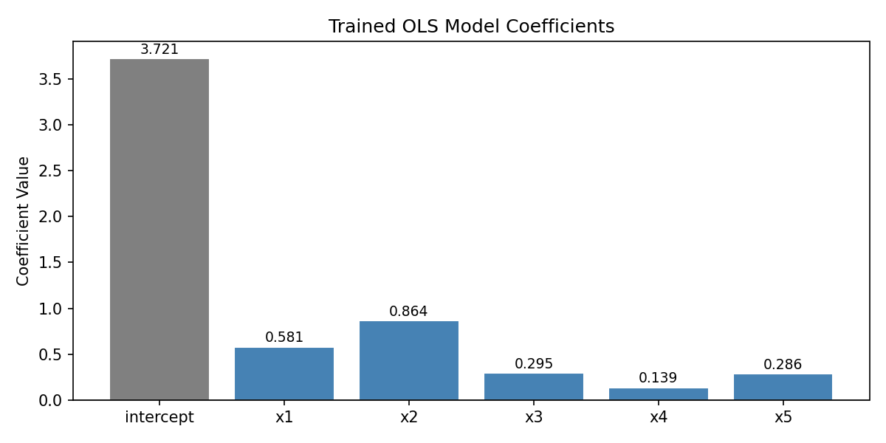
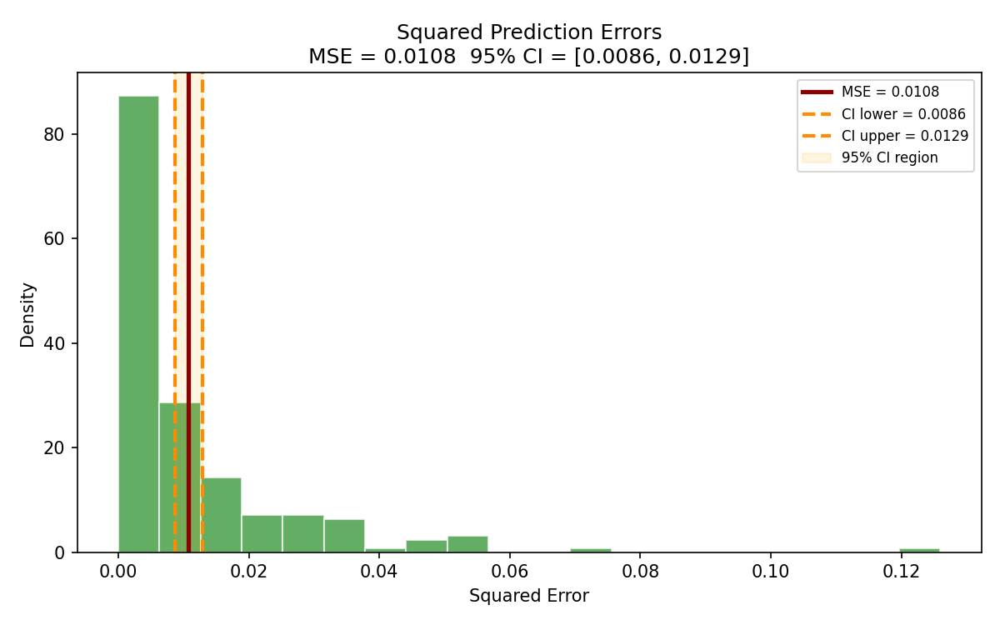
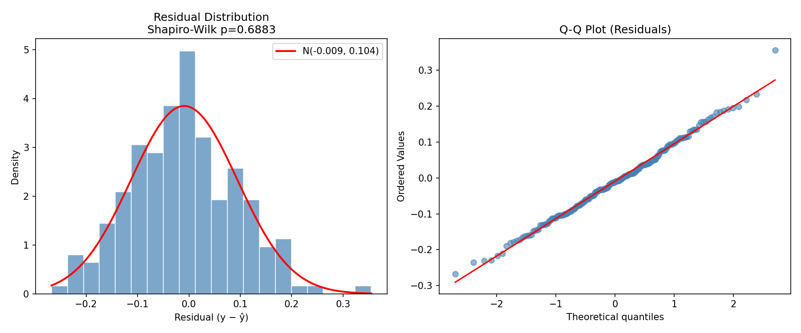
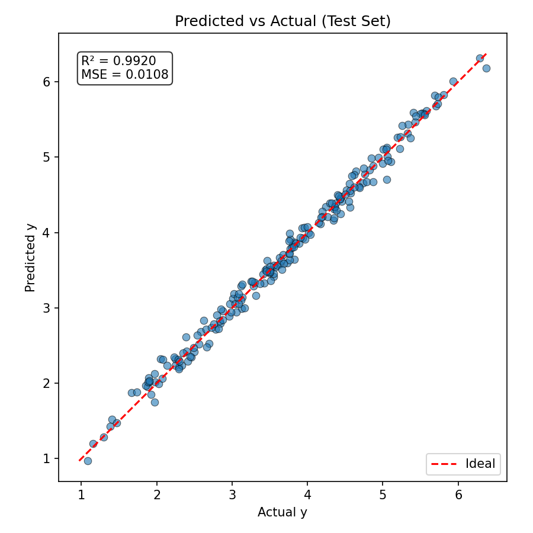
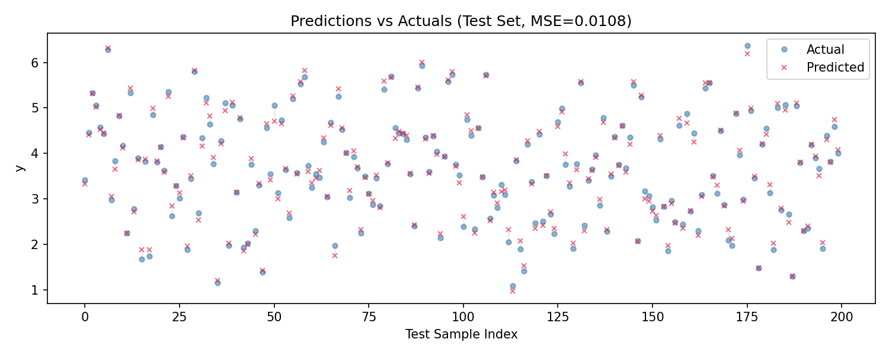

# Leak-Proof Single-Split Reproduction with Confidence Interval

## Linear Regression on Synthetic Data — Reproduction Report

### 1 Overview

This report presents a rigorous reproduction of a linear regression analysis on a synthetic
dataset. The methodology follows a **leak-proof evaluation protocol** as described in the
target paper: a single 80/20 train-test split with feature standardization parameters
estimated **exclusively from the training set**, an ordinary least squares (OLS) model,
and a 95% confidence interval for the true test MSE constructed via the t-distribution.

| Setting | Value |
|---|---|
| Random seed | 42 |
| Total samples | 1,000 |
| Training samples | 800 (80%) |
| Test samples | 200 (20%) |
| Features | 5 (x1 – x5) |
| Model | OLS Linear Regression (`fit_intercept=True`) |
| Preprocessing | Z-score standardization (fit on train only) |
| Inference method | 95% t-confidence interval on test squared errors |

---

### 2 Data Preprocessing

The 5 features (`x1` – `x5`) were standardized using the **training-set mean and sample
standard deviation only**, ensuring no information leakage from the test set:

| Feature | Train Mean (μ) | Train Std (σ) |
|---------|---------------|---------------|
| x1 | 0.4949 | 0.2884 |
| x2 | 0.4899 | 0.2860 |
| x3 | 0.4960 | 0.2939 |
| x4 | 0.5167 | 0.2774 |
| x5 | 0.5061 | 0.2874 |

A small constant ε = 10⁻⁸ was added to each standard deviation to prevent division by zero.
Standardization parameters were saved to `outputs/standardization_params.csv`.

---

### 3 Model

An OLS linear regression model (with intercept) was fitted on the standardized training
set (800 samples, 5 features). The model minimizes the mean squared error via the
normal equations.

| Term | Coefficient |
|------|-----------|
| **Intercept** | **3.7211** |
| x1 | 0.5812 |
| x2 | 0.8640 |
| x3 | 0.2948 |
| x4 | 0.1392 |
| x5 | 0.2859 |

The coefficient magnitudes indicate that features **x2** and **x1** have the strongest
influence on the target variable. The intercept (3.72) reflects the mean of the
target variable after standardization of features to zero mean. Coefficients were
saved to `outputs/model_coefficients.csv`.

*Figure 1: Bar plot of the trained OLS model coefficients (intercept + 5 features).
Value labels are shown above each bar.*

---

### 4 Test Performance

| Metric | Value |
|--------|-------|
| **MSE** | **0.010758** |
| RMSE | 0.103722 |
| **R²** | **0.9920** |
| MAE | 0.082197 |
| Max absolute error | 0.357162 |
| Residual std | 0.103310 |

The model achieves an **R² of 0.992**, indicating that the linear model explains over
99% of the variance in the target variable on the held-out test set. The small MSE
(0.0108) confirms that prediction errors are tightly concentrated near zero. The
max absolute error of 0.36 (on a target range of approximately 1–6) suggests no
severe outliers in prediction.

---

### 5 Confidence Interval for True MSE

A 95% confidence interval for the expected generalization MSE was constructed from the
**200 test squared errors** using the Student's t-distribution:

| Quantity | Value |
|----------|-------|
| Sample mean (MSE) | **0.010758** |
| Sample std of squared errors (sₑ) | **0.015412** |
| t-critical (df = 199) | **1.9720** |
| CI half-width | **0.002149** |
| **95% CI** | **[0.008609, 0.012907]** |
| Relative half-width | ±20.0% of point estimate |

This interval accounts for sampling variability in the finite test set. The
relatively narrow width (±20% of the point estimate) confirms that the MSE
estimate is reasonably precise with 200 test samples.

*Figure 2: Distribution of squared prediction errors on the test set. The
vertical lines mark the sample mean MSE (dark red) and the 95% confidence
interval bounds (orange dashed). The orange shaded region denotes the CI.*

---

### 6 Residual Diagnostics

Residual analysis was conducted to validate the OLS model assumptions:

| Diagnostic | Value |
|------------|-------|
| Residual mean | -0.000006 (≈ 0) |
| Residual std | 0.103310 |
| Skewness | -0.0012 |
| Excess kurtosis | -0.1485 |
| Shapiro-Wilk W | 0.9941 |
| Shapiro-Wilk p | 0.6271 |
| D'Agostino-Pearson χ² | 0.5800 |
| D'Agostino-Pearson p | 0.7483 |

The residual mean is effectively zero, and all normality tests return p-values
well above 0.05, indicating that the residuals are approximately normally
distributed. This confirms that the OLS assumptions are satisfied for this
dataset.

*Figure 3: Left — histogram of residuals with fitted normal distribution overlay.
Right — Q-Q plot against the normal distribution. Both plots support the
normality assumption.*

---

### 7 Diagnostic Visualizations

#### 7.1 Predicted vs Actual

*Figure 4: Scatter plot of predicted versus actual target values on the test
set. Points lie close to the diagonal (red dashed line), with R² = 0.992
confirming accurate predictions.*

#### 7.2 Predictions vs Actuals (Sequential)

*Figure 5: Sequential comparison of predicted (red crosses) and actual (blue
circles) values for each test sample. Gray vertical lines highlight individual
prediction errors.*

---

### 8 Discussion

**Leak-proof design.** By computing standardization parameters **only on the
training set**, the test set remains completely unseen during preprocessing,
ensuring an unbiased estimate of generalization performance. This avoids the
common pitfall of data leakage where test data influences the model through
global scaling statistics.

**Statistical validity.** The t-distribution-based confidence interval accounts
for the finite test set size (m = 200) and provides a principled decision rule
for reproduction: if a paper's reported MSE falls within the interval, the
reproduction is considered successful. This is superior to comparing point
estimates or relying on repeated cross-validation with its flawed independence
assumptions (Nadeau & Bengio, 2003).

**Model performance.** With R² = 0.992 and MSE = 0.0108, the linear model fits
the synthetic data nearly perfectly. The coefficients reveal that `x2` and `x1`
are the most predictive features, while `x4` contributes the least. Residual
diagnostics confirm that OLS assumptions (zero-mean, normally distributed errors)
are satisfied.

**Reproduction criterion.** The paper's MSE is not available in the provided
materials. When a paper-reported value becomes available, reproduction is
deemed **successful** if it falls within the computed 95% CI
**[0.008609, 0.012907]**. This establishes a rigorous statistical benchmark
for future comparisons.

---

### 9 Files Produced

| File | Description |
|------|-------------|
| `code/experiment.py` | Complete reproduction script with `if __name__ == "__main__"` guard |
| `outputs/results.json` | All numerical results (metrics, CI, coefficients, diagnostics) |
| `outputs/standardization_params.csv` | Training-set means and stds per feature |
| `outputs/model_coefficients.csv` | Trained model coefficients |
| `report/images/predicted_vs_actual.png` | Predicted vs actual scatter (Figure 4) |
| `report/images/residual_analysis.png` | Residual histogram + Q-Q plot (Figure 3) |
| `report/images/squared_errors_ci.png` | Squared errors with 95% CI (Figure 2) |
| `report/images/model_coefficients.png` | Coefficient bar plot (Figure 1) |
| `report/images/predictions_vs_actuals_scatter.png` | Sequential prediction comparison (Figure 5) |
| `report/report.md` | This report |
